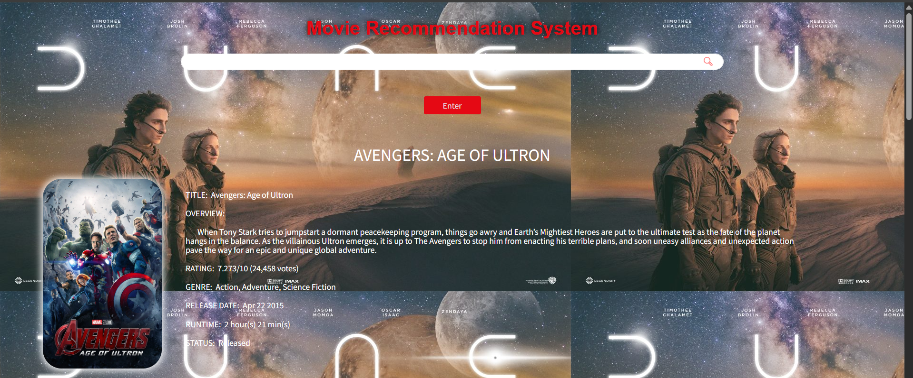

**This is Content Based Recommendation System.**
Steps to run the project-
1) Install all the libraries mentioned in the requirements.txt file with the command- pip install -r requirements.txt
2) Open your terminal in the root directory and run the file main.py by executing the command- python main.py.
3) Open a browser and type the url- http://127.0.0.1:5000/.
4) Now you can search for any movie and press Enter. It will show you details of the movie, top actors in the movie. It will also recommend top 10 movies related to this movie.
Note that the recommendation is based on cosine similarity.
Sample images-

